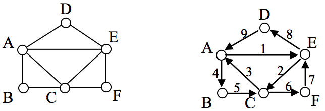
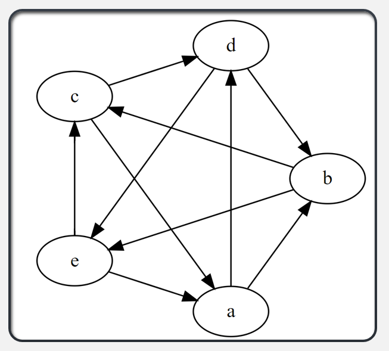
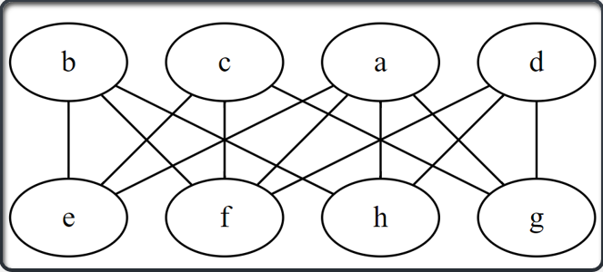
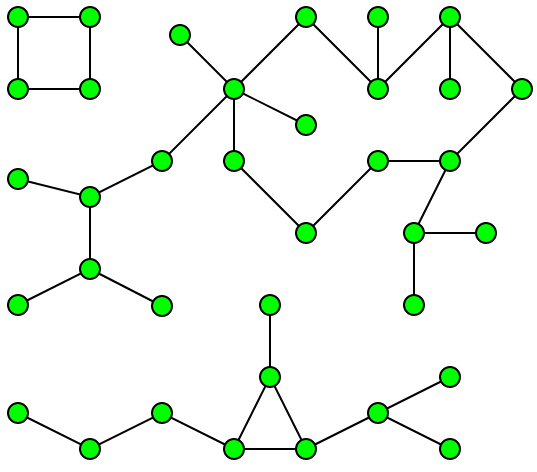
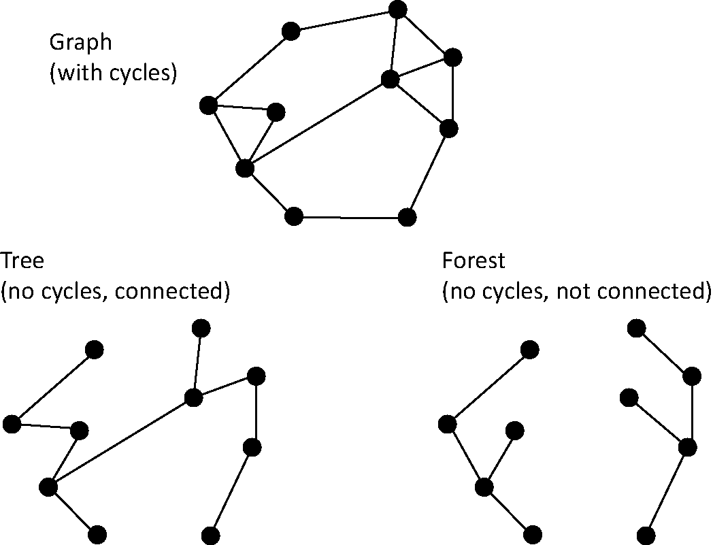
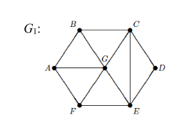
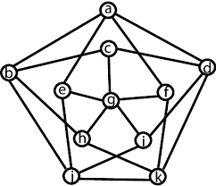

```{r setup, include=FALSE}
knitr::opts_chunk$set(echo = FALSE)
library(igraph)
library(dplyr)
```


Many of my notes in this class are taken from the wonderful primer on the [Alchemist's Fire blog](https://www.alchemistsfire.com/graph-theory-primer). These notes below are for my own use, so I cannot guarantee their readability. I will likely reference material in lecture that I will not write down here. I will not apologize for this inconvenience. 

# Vocabulary
*"Half of graph theory is just vocabulary"* (Alchemistsfire's former professor)

- **Graph:** “*A structure amounting to a set of objects in which some pairs of the objects are in some sense ‘related’. The objects correspond to mathematical abstractions called vertices (also called nodes or points) and each of the related pairs of vertices is called an edge (also called an arc or line)*” – Richard Trudeau, Introduction to Graph Theory (1st edition, 1993)

    - *Alternatively:* "*Think of circles and sticks connected in a pattern.*" (Alchemist's Fire)
    
- **Simple Graph:** A graph in which each edge connects two different vertices and where no two edges connect the same pair of vertices.

- **Multigraph:** A graph that have *multiple edges* connecting the same vertices.

- **Vertex:** The dots, or circles in a graph. These are also called **nodes**. 

- **Edges:** The lines connecting two vertices.

- **Adjacent:** When two vertices are **connected** by an edge. 

- **Degree:** The number of edges adjacent to a vertex.

- **Connected Graph:** For a connected graph, you will always have a path through the graph that will take you from one vertex to another.

- **Disjoint Sub-graph:** If there are two unconnected mini-graphs in one graph. 

- **Walk:** If you were to treat *edges* like bridges and traverse them from one node to another. 
    
    - A walk of length 0 is called **trivial** and will likely not be considered often. 
    
    - Any non-trivial x-y walk where x = y is called a **closed walk**. Otherwise you have an **open walk**.

    - **Path:** A walk where no vertex is repeated.
    
    - **Trail:** A walk where no edge is repeated.
        
        - **Circuit:** A closed x-x trail. 

    - **Cycle:** A *walk* in which only the first and last vertices are repeats. Example: f-g-h-f

- **Eurler's Circuit:** Visiting every single edge of a graph only one time, beginning and ending at the **same** vertex. This cannot be done if any vertex is of *odd* degree.

```{r, out.width="60%"}

print("Example of an Euler Circuit")
```

- **Euler Chain:** Otherwise known as an *Euler Walk* or an *Euler Trail*, involves traversing every edge exactly once, beginning and ending on a **different** vertex of odd degree. This requires at least *two* vertices of odd degree. 

- **Spanning Sub-Graph:** A sub-graph that contains all vertices of the original graph.

- **Hamilton Path:** A spanning sub-graph of $G$ that touches every single vertex one time.

    - **Hamilton Cycle:** Same thing as a *Hamiltonian Path* but a cycle instead. *Wow*. 

        - The *knights tour* puzzle is an example of one such puzzle. 
        
    - On Hamiltonian stuff the starting position does not actually matter.
        
- **Directed Graph** A graph where the edges have arrows. 

    - **Head:** The end of the edge with the arrow.
    
    - **Tail:** The end without the arrow.
    
    - **Indegree:** Degree counting the adjacent edges coming *into* a node.
    
    - **Outdegree:** Degree counting the adjacent edges coming *out* of a node.
    
    - **Tournament:** A graph made by assigning direction to every edge in an undirected complete graph.
```{r, out.width="150px"}

print("Example of a tournament.")
```

- **Bipartite Graph:** A graph whose vertices can be divided into two disjoint and independent sets $U$ and $V$ such that every edge connects a vertex in $U$ to one in $V$. 

    - This concept can be extended. For example, you can have **tri-partite** graphs and even simply just **n-partite** graphs. 
    
    - **Complete Bipartite Graph:** When a vertex in one partition connects to every vertex in the other partition. 
    
    - These will always have: $\chi(G) = 2$

    
```{r, out.width="150px"}

print("Example of a bipartite graph.")
```

```{r, out.width="250px"}
edge_set <- c("a","i", "a","ii", "a","iii", "b","i", "b","ii", "b","iii", "c","i", "c","ii", "c","iii")
igraph::graph(edge_set, directed = FALSE ) |> plot(vertex.size = 30)
print("Example of complete bipartite graph")
```

- **Weighted Graph:** A graph where the edges have some sort of numerical value assigned to them. Think of it like the distance between two nodes though the application of these weights can be far more in-depth than that. 

- **Order of the Graph:** Number of vertices 

- **Components:** A connected sub-graph that is not part of any larger connected subgraph.

```{r, out.width="150px"}

print("Example of a graph with 3 components.")
```


- **Size:** The number of edges

- **Regular Graph:** A graph where the degree of each vertex is equal.

- **Non-trivial Graph:** A graph with **at least** two vertices.

- **Isomorphic:** Two graphs $G_1$ and $G_2$ are isomorphic if there exists a *bijection* between their vertices so that two vertices are connected by an edge in $G_1$ if and only if corresponding vertices are connected by an edge in $G_2$. 

- **Chromatic Number:** If you were to label each vertex with a color with the restriction that no vertex can have an edge directly to another vertex of the same color, the chromatic number is the minimum number of colors needed.
    
    - If the chromatic number between two graphs is different they are not isomorphic.
    
    - A graph with an odd number cycle in it will need a minimum chromatic number of 3. 

- **Graph Complement:** For a graph $G_1$ you have a complement $\overline{G_1}$ that is a graph showing all of the *non-edges* of $G_1$. 
    - If graph complements $\overline{G_1}$ and $\overline{G_2}$ are **not** isomorphic, neither are the original graphs. 
    - Complement Example Using Adjacency Matrices:
```{r, out.width="250px", cache=TRUE}
vertices <- c("A","B", "A","G", "B","C", "C","D", "D","E", "E","F", "F","G")

graph_1 <- igraph::graph(vertices, directed = FALSE)
graph_1[]
```

The complement would look like:
```{r}
igraph::complementer(graph_1)[]
```

- **Planar Graphs:** Graphs that can be drawn on a plane with no crossing edges. Otherwise known as a *planar embedding*.

    - **Four Color Theorem:** Planar graphs will always have the property: $\chi(G) \leq 4$ (1976 Appel & Haken). 
    
        - [Four Colours Suffice, Robin Wilson. Book on this theorem and its history.]

- **Homeomorphic:** Graphs are said to be homeomorphic if both can be obtained from the same graph by *subdivision* of edges.

    - **Subdivision:** Adding an extra vertex onto an edge. 
    
```{r, out.width="50%"}

print("Example of a homeomorphic graph.")
```

- **Forest:** An acyclic graph.

- **Tree:** A connected acyclic graph.

    - Every tree is a forest, but not every forest is a tree.

```{r, out.width="50%"}

```


***
\pagebreak
# Problems

## Worksheet: Introductory Graph Theory I

**Problem 4:** Can there be a simple graph with 8 vertices and 29 edges? Justify your answer.
**Answer:** Max vertex degree if $G$ has 8 vertices is 7. This means that the max degree sum is $8 \cdot 7 = 56$.
Then, the max number of edges for a simple graph is 28. 

**Problem 6: Prove or Disprove:** There is a non-trivial simple graph in which no two vertices have the same degree.

Let's assume the graph in problem 6 exists on $n$ vertices:

Vertices: $V_1, V_2, V_3, ..., V_n$

We are limited to the following list for degrees:

Degrees: $0, 1, 2, ..., n-1$

This breaks down because of the n-1. Think of it like this. If you have 8 dots and that 8th dot needs to connect to 7 other dots to have a unique degree, it can't because one of the dots has to have a degree of 0. 

In other words: This list cannot work because the vertex of degree n-1 would have to have an edge to the vertex of degree 0. This cannot be done. This is an example of *proof by contradiction*. 

***

## Worksheet: Introduction to Graph Theory II - Graph Isomorphism

- 1: Which pairs (if any) of the graphs below are isomorphic?

\begin{tikzpicture}[node distance = {15mm}, thick, main/.style = {draw, circle, minimum size = 0.75cm}]
	\node[main](1) {$a$};
	\node[main](2) [right of=1] {$b$};
	\node[main](3) [below right of=2] {$c$};
	\node[main](4) [below left of=3] {$d$};
	\node[main](5) [left of=4] {$e$};
	\node[main](6) [above left of=5] {$f$};
	\draw (1) -- (2);
	\draw (1) -- (4);
	\draw (1) -- (6);
	\draw (2) -- (3);
	\draw (2) -- (5);
	\draw (3) -- (4);
	\draw (3) -- (6);
	\draw (4) -- (5);
	\draw (5) -- (6);
	\node[above right of=1] {$G_1$};
\end{tikzpicture}
\hspace{1cm}
\begin{tikzpicture}[node distance = {15mm}, thick, main/.style = {draw, circle, minimum size = 0.75cm}]
	\node[main](1) {$g$};
	\node[main](2) [right of=1] {$h$};
	\node[main](3) [below right of=2] {$i$};
	\node[main](4) [below left of=3] {$j$};
	\node[main](5) [left of=4] {$k$};
	\node[main](6) [above left of=5] {$l$};
	\draw (1) -- (2);
	\draw (2) -- (3);
	\draw (3) -- (4);
	\draw (4) -- (5);
	\draw (5) -- (6);
	\draw (1) -- (5);
	\draw (2) -- (4);
	\draw (3) -- (6);
	\draw (6) -- (1);
	\node[above right of=1] {$G_2$};
\end{tikzpicture}
\hspace{1cm}
\begin{tikzpicture}[node distance = {15mm}, thick, main/.style = {draw, circle, minimum size = 0.75cm}]
	\node[main](1) {$1$};
	\node[main](2) [below=0.5cm of 1] {$2$};
	\node[main](3) [below=0.5cm of 2] {$3$};
	\node[main](4) [right=1cm of 1] {$4$};
	\node[main](5) [below=0.5cm of 4] {$5$};
	\node[main](6) [below=0.5cm of 5] {$6$};
	\draw (1) -- (4);
	\draw (1) -- (5);
	\draw (1) -- (6);
	\draw (2) -- (4);
	\draw (2) -- (5);
	\draw (2) -- (6);
	\draw (3) -- (4);
	\draw (3) -- (5);
	\draw (3) -- (6);
	\node[above right of=1] {$G_3$};
\end{tikzpicture}

***

## Webwork Graph Theory Part I
### Problem 6
Construct a simple graph with vertices $R, S, T, U, V, W$ whose degrees are 2, 2, 2, 3, 1, 2

Answer:
    
    - {R,S}{R,W}{S,T}{T,U}{U,W}{U,V}

Visualization:
```{r, out.width="250px", cache=TRUE}
vertices <- c("R","S", "R","W", "S","T", "T","U", "U","W", "U","V")
wwp6 <- igraph::graph(vertices, directed = FALSE)

plot(wwp6, vertex.size=30)
```

### Problem 7
Construct a simple graph that is a tree with vertices $P, Q, R, S, T$ such that the degree of $S$ is 3. 

```{r, out.width="250px", cache=TRUE}
vertices <- c("P","T", "T","S", "S","Q", "S","R")
plot(
    igraph::graph(vertices, directed = FALSE),
    vertex.size=30
)
```

## Chromatic Number Examples
### Example 1
Find the chromatic number of the following graph:
```{r, out.width="50%"}

```

Claim: The minimum chromatic number for this graph is 4. 

Proof: It is known that a graph with an odd numbered cycle has a minimum chromatic number of 3. The cycle A-B-C-E-F-A is a 5 cycle mandating three colors. Since **G** is connected to every vertex in a cycle with three minimum colors, it is forced to have a fourth, new color. Thus, $\chi(G_1) = 4$ $\blacksquare$

***

### Exercise 2
```{r, out.width="30%"}

```

Claim: $\chi(G_1) = 4$

Proof:
To see that 3 colors do not suffice we note that the outer 5-cycle requires 3 colors (say Red, Blue, Green) with 2 vertices Red, 2 vertices Blue, and the fifth outer vertex green. 

W.L.O.G we place these colors as follows: a-red, d-blue, k-red, j-blue, and b-green. Note at this point the following is forced: c-red, e-green, and h-blue. The color of f and i is irrelevant. As g is adjacent to c, e and h, we require a fourth color.

$\chi(G) = 4$

$\blacksquare$

\pagebreak

# General Notes

- How the graph is drawn does not matter, what matters is the vertices and edges. If both graphs have the same vertex and edge set they're the same graph, it doesn't matter how much more wack one visual interpretation is than another. 

- Proving that two adjacency matrices are identical programatically is actually an example of an **NP** problem. There is no finite list of things to check that would prove that two adjacency matrices are the same. Thankfully proving their different isn't, so that's nice I suppose. 

- To go into more detail here, to manually check that one graph is isomorphic to another, assuming you have $n$ vertices, you would need to check $n!$ different ways of arranging labels. If even **one** of those arrangements is correct the two graphs are isomorphic. That means even if you have 6 vertices, even checking a hundred different arrangements isn't enough to rigorously prove that the two graphs are different. 

- Let $e$ = edges. 
\[\frac{\text{degree sum}}{2} = e\]

- List of ways to tell if a degree sequence is impossible for a simple graph.
    - Vertices has degrees greater than or equal to the number of vertices.
    - Sum of degrees is odd.
    - For n vertices if one has degree $n-1$ and another has degree 0.
    - For n vertices the sum of the degrees cannot be greater than $n(n-1)$. 


- **Leonard Euler:** Every time we have a *planar embedding* of a connected graph, Euler's formula of $|V| + |F| - |E| = 2$ will hold.  

- **Kuratowski's Theorem:** A graph is planar if and **only** if the graph has **no** sub-graphs homeomorphic to $K_5$ or $K_{3,3}$.  

- A complete bipartite graph $K_{n,m}$ has *both* a Hamilton path **and** cycle if and **only** if $n=m$ and if $n > 1$. Otherwise it has neither. 

- Every complete connected graph $K_n$ is Hamiltonian as long as $n > 2$. 

- **Prim's Algorithm:**

    1) Start by adding one vertex to the tree.
    
    2) Find a "cheapest" edge that connects to the tree thus far, but which does not form a cycle, and add it (and its vertex) to the tree.
    
    3) Keep repeating step 2 until there are no more edges that can be added without creating a cycle. If the graph is connected, the tree with be a minimum weight spanning tree. If the graph is not connected, then the algorithm terminates with a non-spanning tree. 
    
- **Kruskal's Algorithm:**

    1) Sort all of the edges in ascending order.
    
    2) Pick the lowest cost edge, check cost of all adjacent edges. If the lowest cost edge does *not* create a cycle, include it, if it does, do not include it.
    
    3) Repeat until you're done. 

\pagebreak

# Reference Material

```{r}
repeated_vertex <- c("Yes", "Yes", "Yes", "Yes", "No", "No")
repeated_edges <- c("Yes", "Yes", "No", "No", "No", "No")
open <- c("Yes", "N/A", "Yes", "N/A", "Yes", "N/A")
closed <- c("N/A", "Yes", "N/A", "Yes", "N/A", "Yes")
name <- c("Walk (open)", "Walk (closed)", "Trail", "Circuit", "Path", "Cycle")

df <- data.table::data.table(
    "Name" = name,
    "Repeated Vertex" = repeated_vertex,
    "Repeated Edges" = repeated_edges,
    "Open" = open,
    "Closed" = closed
) |> 
    tibble::as_tibble()

knitr::kable(
    df
)
```

```{r, results='asis'}
type <- c("Simple Graph", "Multigraph", "Pesudograph", "Simple Directed Graph", "Directed Multigraph", "Mixed Graph")
edges <- c("Undirected", "Undirected", "Undirected", "Directed", "Directed", "Directed and Undirected")
multi_edge_allowed <- c("No", "Yes", "Yes", "No", "Yes", "Yes")
loops <- c("No", "No", "Yes", "No", "Yes", "Yes")

df <- data.table::data.table(
    "Type" = type,
    "Edges" = edges,
    "Multiple Edges Allowed?" = multi_edge_allowed,
    "Loops Allowed?" = loops
)

knitr::kable(
    df
)
```