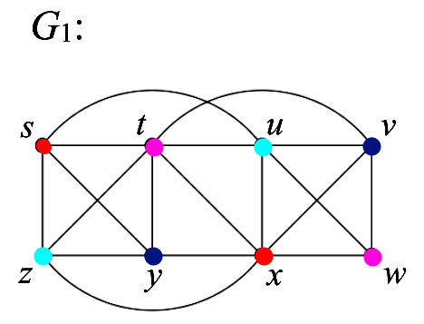
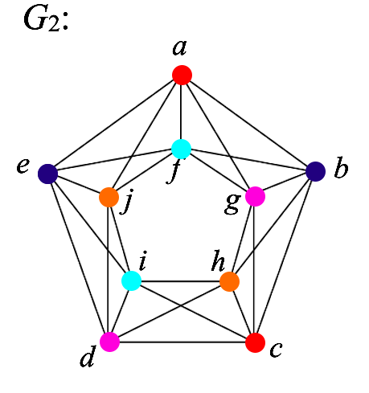

```{r setup, include=FALSE}
knitr::opts_chunk$set(echo = FALSE)
library(dplyr)
library(igraph)
```

# Problem 1:
Are the two graphs shown isomorphic? If yes, then show it with a relabeling. If not, then give a convincing argument about how they structurally differ. 

```{r, echo=FALSE,out.width="49%", out.height="20%",fig.show='hold',fig.align='center'}
    knitr::include_graphics(c("images/whw1_pr1_fig1.png","images/whw1_pr1_fig2.png"))
``` 

These two graphs are **NOT** isomorphic. To prove this we can examine the degree neighbors of all of the vertices with degree four and compare them between graphs. To clarify the notation, as an example, we can use the **a** node in $G_1$. I can show its list of degree neighbors as $a(3)\{4,4,4\}$ which shows that node a, having degree 3, is connected to 3 nodes each with a degree of 4. 

Let us first examine this for $G_2$.
\begin{align*}
    t(4)\{3, 4, 4, 4 \} \\
    w(4)\{4, 4, 4, 3\} \\
    u(4)\{3, 3, 4, 4\} \\
    z(4)\{3, 4, 4, 3\}
\end{align*}
We need only look at one example in $G_1$ to see the discrepancy. Let us look at node **b**.

\[b(4)\{3,4,3,3\}\]

What we see here is a set of degree neighbors that does **NOT** match anything found in $G_2$. There is not a single node with degree 4 that is connected to three nodes with degree 3. Due to this it can be stated that $G_1$ and $G_2$ are **not isomorphic**. $\blacksquare$

***
\pagebreak
# Problem 2:
For each of the graphs $G_1$ and $G_2$ below, find the chromatic numbers, $\chi(G_1)$ and $\chi(G_2)$. Justify your answers, giving a convincing argument that fewer colors will not suffice in each case. 

```{r, echo=FALSE,out.width="49%", out.height="20%",fig.show='hold',fig.align='center'}
    knitr::include_graphics(c("images/whw1_prob2_g1.png","images/whw1_pr2_g2.png"))
```

For $G_1$ I will first show a visual of the final product and then justify the process used.

```{r, out.width="50%"}

```

Before we properly start, we can recognize that we have a $K_4$ sub-graph in **s, t, z, y**. This mandates $\chi(G_1) \geq 4$ by default, so the goal will be to minimize the chromatic number from here. 

Let us start with the $K_4$ sub-graph. I make the following forced assignments.

- **s:** Red
- **z:** Cyan
- **t:** Purple
- **y:** Blue

From here we can move to **u**. It is connected to both s and t so either cyan or blue are fair game. I chose cyan. 

Examining **x** next, it is forced to be red from all of its other connections. A similar situation is found with **v**, which is forced to be blue. Finally then, we have **w** which is forced to be purple. 

We have accomplished a coloring that sticks with the minimum we knew we had before starting given the $K_4$ sub-graph. As such, we can say that $\chi(G_1) = 4$. $\blacksquare$

\pagebreak

As with $G_1$ I will first show the visual. $\chi(G_2) = 5$ is proposed here.

```{r, out.width="50%"}

```

Starting with initial observations, we have multiple odd numbered cycles present here. The outside and inside cycles are odd mandating $\chi(G_2) \geq 3$. 

Starting with the outside forced assignments we have:

- **a, c:** Red
- **b, e:** Blue
- **d:** Purple

From here we move to **i** which is forced to have a fourth color, cyan. The next vertex, **d** presents a problem. It is connected to all 4 colors currently and so a fifth color, orange, is forced. The assignments for **g, f** and **j** are flexible. The ordering I chose allows for the addition of no new colors.

- **g:** Purple
- **f:** Cyan
- **j:** Orange

From this process we can see that a chromatic number of 5 is mandated here. Everything but the final three vertice colors are completely forced and as such there can be no process that utilizes less colors. From this we can state that $\chi(G_2) = 5$. $\blacksquare$

***
\pagebreak
# Problem 3:
For each graph shown below, decide if the graph is planar or not. For those that are, give a planar embedding and show that Euler's formula is satisfied. For those that are not, find a sub-graph homeomorphic to $K_5$ or $K_{3,3}$.
```{r, echo=FALSE,out.width=c("49%", "100%"), out.height=c("20%", "20%"),fig.show='hold',fig.align='center'}
knitr::include_graphics(c("images/whw1_pr3a_start.png","images/whw1_pr3a.png"))
```

Above I have a planar embedding of $G_a$ which we will call $H_a$. Euler's formula states that $v + f - e = 2$ and applying this to $H_a$ gives $6 + 7 - 11 = 2$ which holds. 

$\therefore$ $G_a$ is an example of a **planar** graph. $\blacksquare$

***

```{r, out.width="49%", out.height="20%", fig.show='hold', fig.align='center'}
knitr::include_graphics(c("images/whw_pr3b.png", "images/whw_pr3b_nonplanar.png", "images/pr3b_k33_subgraph.png"))
```

Above I have the graph $G_b$, the same graph which has been rearranged, and the $K_{3,3}$ sub-graph within $G_b$. It is known that a graph is non-planar if it contains either the sub-graphs for $K_5$ or $K_{3,3}$. I propose that $G_b$ is non-planar because, as my re-arrangement shows, it contains the $K_{3,3}$ sub-graph. In fact, the only differences between this graph and $K_{3,3}$ are an additional vertex and 7 additional edges. 

$\therefore$ $G_b$ is an example of a **non-planar graph**. $\blacksquare$

***
\pagebreak

```{r, out.width="49%", out.height="30%", fig.show='hold', fig.align='center'}
knitr::include_graphics(c("images/pr3c_starting_graph.png", "images/pr3c_k3subgraph.png"))
```


To prove that this graph, $G_c$, is non-planar, again, requires either a sub-graph of $K_{3,3}$ or $K_5$. The latter cannot be the case with $G_c$ as none of the vertices have a degree of 4. Every vertex in $G_c$ has a degree of 3 instead which indicates a possible $K_{3,3}$ sub-graph. I believe I have shown said sub-graph with the rearrangement above. It is a far more complex version of $K_{3,3}$, but following the edges between vertices leads to the same overall structure. Due to the rotational symmetry of this graph as well there are any number of similar $K_{3,3}$ sub-graphs that can be shown. We can then say that there are *multiple* $K_{3,3}$ sub-graphs within $G_c$, making it impossible for there to be a planar embedding. 

$\therefore$ $G_c$ is another example of a **non-planar graph**. $\blacksquare$