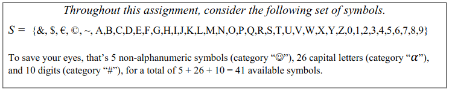

```{r setup, include=FALSE}
knitr::opts_chunk$set(echo = TRUE)
```



# Problem 1
**How many passwords of length 5 are possible with all 41 symbols in the set, if there are no rules?**

For this we have 41 options 5 times. We can repeat symbols and the only restriction is the length. As such we know the number of possible passwords, $p$ is:

\[p = 41 \cdot 41 \cdot 41 \cdot 41 \cdot 41 = 41^5 = 115856201\]

# Problem 2

**How many passwords of length 5 are possible with the full 41 symbol set if NO repeats are allowed?**

This means we have another restriction, repetition. We have 41 symbols for the first spot, but can't use the same symbol twice which means we have 40 symbols for the second spot. This trend follows for all 5 spots. As such:

\[p = 41 \cdot 40 \cdot 39 \cdot 38 \cdot 37 = 41 \; nPr \; 5 = 89927760\]

\pagebreak
# Problem 3

**How many passwords of length 5 are possible with the full 41 symbol set that meet the following form?**

\[\text{non-alpha}, \text{alpha}, \text{numeric}, \text{numeric}, \text{numeric}\]

For this we have 5 non-alpha options, 26 alpha options, and 10 numeric options. We have 1 non-alpha spot, 1 alpha spot and 3 numeric spots. There are no restrictions to repetition for the numeric spots.

\[5 \cdot 26 \cdot 10 \cdot 10 \cdot 10 = 130000\]

# Problem 4

**Using the same set up as problem 3, how many passwords can we generate if we're restricted to the characters in the string: `!@###` ?**

If we were to assume all 5 characters here were distinct, we would have 5! options. That isn't the case though, 3 of these characters are identical. So what we do to accommodate for that is to divide by the factorial of the repeated characters. So, what we have then is:

\[\frac{5!}{3!} = 5 \cdot 4 = 20\]

# Problem 5

**How many passwords of length 5 are possible with the full 41 symbol set if there has to be exactly 1 non-alpha, one letter, and exactly 3 digits.**

Let us think on our answer to problem 3. Problem 3 gives us one ordering that satisfies our restrictions. That's it though, we still have other orderings that satisfy the answer. To get the number of orderings of that form, we use our answer to problem 4, which is 20 orderings. Therefore, combining our answers to both gives us

\[20 \cdot 5 \cdot 26 \cdot 10^3 = 2600000\]

# Problem 6

For this we can use our answer to problem 3, we just need to change the $10^3$ to accomodate for the no repeat restriction. That gives us:

\[5 \cdot 26 \cdot 10 \cdot 9 \cdot 8 = 93600\]

\pagebreak
# Problem 7

**Using our restrictions from problem 5, how many passwords do we have if we can have no repetitions of symbols?**

We need not over think this. We can rewrite out the larger calculation and change some numbers. Instead of $10^3$, we will have $10 \cdot 9 \cdot 8$.

\[\frac{5! \cdot 5 \cdot 26 \cdot 10 \cdot 9 \cdot 8}{3!} = 20 \cdot 5 \cdot 26 \cdot 10 \cdot 9 \cdot 8 = 1872000\]

# Problem 8

## Long Way

Let: 

- S = Non-alpha symbol
- L = Letter
- N = Numeric

- Case 1: SLNNN $5 \cdot 26 \cdot 10^3 \cdot 20 = 2600000$
- Case 2: SLLNN $5 \cdot 26^2 \cdot 10^2 \cdot 30 = 10140000$
- Case 3: SLLLN $5 \cdot 26^3 \cdot 10 \cdot 20 = 17576000$
- Case 4: SSLLN $5^2 \cdot 26^2 \cdot 10 \cdot 30 = 5070000$
- Case 5: SSSLN $5^3 \cdot 26 \cdot 10 \cdot 20 = 650000$
- Case 6: SSLNN $5^2 \cdot 26 \cdot 10^2 \cdot 30 = 1950000$
- Case Total: $\boxed{37986000}$

## Short Way

Let:
\[n = \text{all outcomes} = 41^5\]
\[a = \text{missing S} = (41-5)^5\]
\[b = \text{missing L} = (41-26)^5\]
\[c = \text{missing N} = (41-10)^5\]
\[a \cap b = 10^5\]
\[a \cap c = 26^5\]
\[b \cap c = 5^5\]


\[x = n - (a + b + c) + (a \cap b) + (a \cap c) + (b \cap c) = \boxed{37986000}\]

# Problem 9

Let: 

- S = Non-alpha symbol
- L = Letter
- N = Numeric

- Case 1: SLNNN $5 \cdot 26 \cdot 10 \cdot 9 \cdot 8 \cdot 20 = 1872000$
- Case 2: SLLNN $5 \cdot 26 \cdot 25 \cdot 10 \cdot 9 \cdot 30 = 8775000$
- Case 3: SLLLN $5 \cdot 26 \cdot 25 \cdot 24 \cdot 10 \cdot 20 = 15600000$
- Case 4: SSLLN $5 \cdot 4 \cdot 26 \cdot 25 \cdot 10 \cdot 30 = 3900000$
- Case 5: SSSLN $5 \cdot 4\cdot 3 \cdot 26 \cdot 10 \cdot 20 = 312000$
- Case 6: SSLNN $5 \cdot 4 \cdot 26 \cdot 10 \cdot 9 \cdot 30 = 1560000$
- Case Total: $\boxed{32019000}$


## Short Way

Let:
\[n = \text{all outcomes} = 41 \cdot 40 \cdot 39 \cdot 38 \cdot 37\]
\[a = \text{missing S} = 36 \cdot 35 \cdot 34 \cdot 33 \cdot 32\]
\[b = \text{missing L} = 15 \cdot 14 \cdot 13 \cdot 12 \cdot 11\]
\[c = \text{missing N} = 31 \cdot 30 \cdot 29 \cdot 28 \cdot 27\]
\[a \cap b = 10 \cdot 9 \cdot 8 \cdot 7 \cdot 6\]
\[a \cap c = 26 \cdot 25 \cdot 24 \cdot 23 \cdot 22\]
\[b \cap c = 5 \cdot 4 \cdot 3 \cdot 2 \cdot 1\]


\[x = n - (a + b + c) + (a \cap b) + (a \cap c) + (b \cap c) = \boxed{32019000}\]